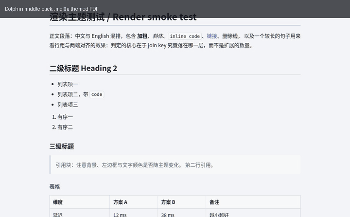

# md-preview

[](https://github.com/BenXsha/md-preview/actions/workflows/test.yml)
[](LICENSE)

**在 Dolphin 里鼠标中键一点，`.md` 就以排好版的样子出现** —— 用纯 CSS 主题渲染成 PDF 交给 Okular
（或渲染成 HTML 交给浏览器），并且带缓存，第二次点是秒开。

> English docs: [README.md](README.md)

## 解决的问题

KDE 里对文件按鼠标中键，打开的是**该 MIME 类型应用列表里的第 2 个应用**
（Dolphin 源码 `DolphinViewContainer::slotfileMiddleClickActivated`）。`.md` 这个位置默认落在 Okular 上，
而 Okular 的 Markdown 后端只有两个设置：**默认字体** 和 **SmartyPants 开关**；纸面与文字颜色是写死的
（`image.fill(Qt::white)`、`QPalette::Text` 固定黑色），页宽页边距也写死。长文档就是一大片黑字，且完全没法换样式
（上游需求单 [400529](https://bugs.kde.org/show_bug.cgi?id=400529)、
[426682](https://bugs.kde.org/show_bug.cgi?id=426682) 至今开着）。

**md-preview 不去改 Okular**，而是接管中键那个位置，把渲染交给完整的 CSS 引擎：于是预览有了真正的排版、
真正的深色模式、可自由更换的主题；Okular 继续做它擅长的事（翻页、缩放、批注）。



*动图由 `python3 tools/middle-click-demo.py` 用 `tests/sample.md` 生成。*

## 特性

- **为 KDE 的工作流而做** —— 占住 Dolphin 中键槽位；`Shift+中键` 走浏览器预览；可选装一个 Dolphin
  右键「服务菜单」项。全用户级安装，不需要 sudo。
- **重复打开是秒开** —— 按「源文件 mtime + 主题文件 + 脚本」做缓存签名，内容没变直接复用上次产物。
- **纯 CSS 主题** —— 生成的 HTML 遵循通用的 Markdown 主题 DOM 约定（`#write`、`pre.md-fences`、
  `div.CodeMirror.cm-s-inner`、`.cm-*` token 类），按这套约定写的主题可以直接用。自带两个 MIT 主题
  （`default`、`default-dark`），离线即可用。
- **代码配色跟着主题走** —— Pygments 的 token 同时带 CodeMirror 类名，主题自带的配色能命中；主题没定义时
  用内置的浅色/深色两套配色兜底。
- **浅深色自动处理** —— 读主题给页面设的底色（支持 `var(--bg-color)` 间接引用、逗号选择器；会跳过注释掉的
  声明和 `prefers-color-scheme: dark` 块）判断深浅；对「把页面底色交给宿主应用」的主题自动补上背景色。
- **为网页写的样式表做了打印修正** —— A4 `@page` 页边距、打印时去掉主题的栏宽、`print-color-adjust: exact`
  让深色底和代码块底色在 PDF 里不丢。
- **依赖轻** —— Python + `markdown-it-py` + `Pygments`；PDF 用无头 Chromium（自动探测
  Edge/Chrome/Chromium/Brave）；没有 Chromium 时自动退回浏览器预览。
- **公式与图表** —— `$…$` / `$$…$$` 交给 KaTeX，` ```mermaid ` 代码块交给 Mermaid 渲染。
  两者都按需下载（`md-preview --fetch-assets`）、仓库不打包；缺资源时降级为源码显示而不是报错。
  深色主题会自动切换到 Mermaid 的 dark 主题。
- **超长代码行不会被裁掉** —— 代码块折行（屏幕与打印一致，不再出现横向滚动条）；
  `#write { overflow-wrap: anywhere }` 同时解决行内代码、表格长串撑破版面后在 PDF 里丢字的问题。
  `--no-code-wrap` 可让屏幕退回横向滚动（打印始终折行：纸上没有滚动条，被裁掉的内容没法再找回来）。
- **任务列表 / 告警块 / 脚注** —— `- [ ]` / `- [x]`、`> [!NOTE]`（note / tip / important / warning / caution）
  与 `[^1]` + `[^1]: 说明` 都能原生渲染，靠手写的 markdown-it 规则（不引插件、不联网）；
  `--no-tasklists` / `--no-alerts` / `--no-footnotes` 可以把它们退回成原文。

## 安装

### 从仓库安装（推荐，会一并配好 KDE 集成）

```console
$ git clone https://github.com/BenXsha/md-preview.git && cd md-preview
$ ./contrib/install.sh --help      # 先看它到底动哪些文件
$ ./contrib/install.sh             # 装脚本 + 自带主题 + desktop 项 + 中键槽位顺序
```

全部落在用户目录（`~/.local/bin`、`~/.config/md-preview`、`~/.cache/md-preview`、
`~/.local/share/applications`、`~/.local/share/kio/servicemenus`），改 `~/.config/mimeapps.list` 之前会先备份。
卸载：`./contrib/uninstall.sh`（一键还原）。

### 升级

`install.sh` 是把 `src/md_preview/cli.py` **拷贝**到 `~/.local/bin/md-preview` 的，而 Dolphin 中键跑的是这份拷贝、
不是你的 clone。所以 `git pull` 之后要重跑一次安装脚本，否则预览用的还是旧代码
（`config`、已下载的主题与 `~/.config/md-preview/style.css` 都会保留）：

```console
$ git pull && ./contrib/install.sh
```

缓存 PDF 的签名包含「源文件 mtime + 脚本 + 主题 + 配置」，脚本一换就会自动重渲染，不用手动清
`~/.cache/md-preview`。

### 用 pipx

```console
$ pipx install .          # 或 pip install --user .
$ md-preview --version
```

PyPI 上的**发行名**是 **`md-preview-kde`**（`md-preview` 已被别的项目占用），命令名仍然是 `md-preview`；
Arch 用户也可以用 `contrib/aur/PKGBUILD`（AUR 包名 `md-preview`）。

### 只要一个文件

`src/md_preview/cli.py` 是自包含的（只用标准库 + `markdown-it-py` + `Pygments`）：

```console
$ install -Dm755 src/md_preview/cli.py ~/.local/bin/md-preview
```

### 依赖

| 依赖 | 用途 |
| --- | --- |
| Python ≥ 3.10 | 运行时 |
| `markdown-it-py[linkify]`、`Pygments` | Markdown → HTML（裸 URL 自动成链接）、代码高亮 |
| Chromium 系浏览器 | PDF 引擎（`--headless=new --print-to-pdf`），自动探测 Edge/Chrome/Chromium/Brave |
| Okular 或任意 PDF 阅读器 | 看生成的 PDF；没有就退回浏览器 |
| Pillow、websockets（可选） | 只有 `tools/theme-gallery.py`、`tools/probe-styles.py` 用 |
| KaTeX / Mermaid（可选） | 公式与图表渲染；`md-preview --fetch-assets`，系统已装的 `libjs-katex` 也会被使用 |

## 在 KDE 里怎么用

`contrib/install.sh` 之后，Markdown 的槽位是这样排的：

| 槽位 | 触发方式 | 打开谁 |
| --- | --- | --- |
| 0 | 双击 / 回车 | 你的编辑器（如 Kate）—— 不变 |
| 1 | **鼠标中键** | **md-preview** → 带主题的 PDF → Okular |
| 2 | `Shift` + 中键 | md-preview `--html` → 浏览器 |
| 3+ | 右键 → 打开方式 | 原来的 Okular 预览仍在列表里 |

```console
$ md-preview notes.md                # 生成带主题的 PDF，用 Okular 打开（带缓存）
$ md-preview --html notes.md         # 生成带主题的 HTML，用浏览器打开
$ md-preview --theme default-dark notes.md
$ md-preview --list-themes
$ md-preview --fetch-assets katex mermaid  # 可选：启用公式与图表（MIT 资源）
```

在 Dolphin 里右键 `.md`，还能从服务菜单直接选 **Markdown 预览（PDF / 浏览器）**。

为什么占第 1 位而不是编辑器位？因为中键正是你「只想看一眼」时的手势，而双击留给编辑。
机制、排序规则与坑：参见 [`docs/kde-dolphin-middle-click.md`](docs/kde-dolphin-middle-click.md)。

## 主题

主题就是一个 CSS 文件。自带（MIT，永远可用，不需要联网）：

| 主题 | 观感 |
| --- | --- |
| `default` | 浅色，52 rem 正文宽度，类 GitHub 的代码块，中文字体栈 |
| `default-dark` | 对应深色版，版式一致；PDF 里保留深色底 |

可选的、许可明确的来源（需要显式拉取：`md-preview --fetch-themes drake mdmdt`）：
[MIT](https://github.com/liangjingkanji/DrakeTyporaTheme) 与
[Apache-2.0](https://github.com/cayxc/Mdmdt) 两套社区 CSS。其它主题用
`md-preview --install-theme <文件|URL>` 自行安装 —— **该主题的许可由你自己确认**，
30 秒自查清单见 [`docs/theme-licensing.md`](docs/theme-licensing.md)。

```console
$ md-preview --list-themes
$ md-preview --theme-dir            # 把任意 .css 丢进这个目录就成为一个主题
$ md-preview --install-theme ~/Downloads/my-theme.css
```

想对比观感，用截图更直观：

```console
$ python3 tools/theme-gallery.py     # 每个主题一张 PNG，并拼成一张对比图
```

### 自己写主题

生成的 DOM（这是兼容性接口，会保持稳定）：

| 选择器 | 元素 |
| --- | --- |
| `#write` | 正文容器（`<div id="write" class="typora-export">`） |
| `body.typora-export` | 页面根；判定为深色主题时会额外加 `md-dark` |
| `pre.md-fences` | 代码块外壳 —— 背景/边框/圆角写这里 |
| `pre.md-fences > div.CodeMirror.cm-s-inner` | 代码块内层 |
| `.cm-keyword` `.cm-string` `.cm-comment` `.cm-def` `.cm-number` … | 语法 token |
| 普通元素 | `#write h1`、`p`、`table`、`blockquote`、`code`、`hr`、`img` |

两条踩坑经验：

- **不要**把 `cm-s-inner`/`CodeMirror` 加在 `<pre>` 上：有些主题带
  `.cm-s-inner.CodeMirror { background: none }`（特异性 0,2,0），会把 `.md-fences` 的底色抹掉。
  代码块做成两层嵌套正是为了避免这个。
- 有些主题把页面底色交给宿主应用，自己只定义 `--bg-color`。这种情况 md-preview 会补上
  `body { background-color: var(--bg-color, …) }`，并按深色主题处理。

## YAML 头部（front matter）

`SKILL.md`、博客文章、笔记模板这类文件都以 YAML 头部开头。Markdown 会把它渲染成一条孤立的分隔线加一个
被吃坏的标题 —— md-preview 改成渲染成一张**信息卡**：

```console
$ md-preview --front-matter card SKILL.md   # 默认：name/version/日期做 chips + description + 其余字段
$ md-preview --front-matter raw SKILL.md    # 原文放进代码块
$ md-preview --front-matter off SKILL.md    # 直接去掉头部
```

卡片把 `name`/`title` 作为标题（文档没有 H1 时也用作窗口标题），`version`、`license`、`author`、`created`、
`updated`、`date`、`status`、`model` 做成 chips，列表（`tags`、`keywords`…）渲染成 chip 行，
其余字段按「键/值」排列，`description` 排在最前面。

- 解析优先用 [PyYAML](https://pyyaml.org/)；没装就用内置的子集解析器（标量、引号、行内列表、块列表、
  块标量）。两者都解析不出时，在卡片里原样显示并给出提示，而不是把内容丢掉。
- 只是以 `---` 开头的普通文档（分隔线）**不会**被当成头部：必须中间至少有一行 `key:`，并且有结束的 `---`。
- 样式钩子：`.front-matter`、`.fm-title`、`.fm-name`、`.fm-chip`、`.fm-fields`、`.fm-chips`、`.fm-raw`
  以及 `--mp-frontmatter-bg` 变量（见 [`themes/README.md`](themes/README.md)）。

## 公式与图表

```console
$ md-preview --fetch-assets              # 下载 KaTeX（含字体）+ Mermaid 到 ~/.config/md-preview/assets/
$ md-preview notes.md                    # $…$、$$…$$ 与 ```mermaid 代码块都能渲染了
$ md-preview --no-math --no-mermaid notes.md
$ md-preview --no-code-wrap notes.md     # 超长代码行：屏幕改回横向滚动（PDF 仍折行）
```

- 行内 `$…$` 与块级 `$$…$$` 会先被转成 HTML 里的占位元素（这样 Markdown 不会把 `$x_i$` 吃成斜体），
  再由浏览器里的 KaTeX 渲染；`$5`、`$100` 这类货币保持原样。
- ` ```mermaid ` 代码块变成 `.mermaid` 容器交给 Mermaid 渲染，流程图/时序图/甘特图/类图/状态图都可用；
  深色主题自动使用 Mermaid 的 dark 主题。
- 资源查找顺序：配置里的 `assets_dir` → `~/.config/md-preview/assets/<kind>` → 系统目录
  （例如 `libjs-katex` 装出来的 `/usr/share/javascript/katex`）。
- 转 PDF 时会给页面留一段虚拟时间预算（`js_budget`，默认 10 秒）等 JS 渲染完再快照；
  缺资源时降级为源码显示，并在 stderr 给出提示。
- 代码高亮不需要这些：Pygments 在服务端跑，token 类名跟着主题走（见上文）。

## 配置

`~/.config/md-preview/config`：

```ini
theme      = default        # --list-themes 看全部可用主题
dark_theme = default-dark   # 浏览器预览时系统为深色模式则用它（留空 = 不换）
pdf_theme  =                # PDF 模式专用主题（留空 = 同 theme）
```

命令行可临时覆盖：`--theme` / `--dark-theme` / `--pdf-theme`。
`--html` 走浏览器（连续滚动、页内查找、跟随系统深浅色）；默认走 PDF 交给 Okular（批注、书签、单页/连续）。

## 工作原理

```
.md ──markdown-it-py──▶ HTML（Pygments 与 CodeMirror token 类）──┬─▶ 注入主题 CSS ─▶ 浏览器
                                                                 └─▶ 无头 Chromium --print-to-pdf ─▶ Okular
```

- 主题文件用 `<link>` 原样引用，主题自带的相对路径字体/图片因此能正确加载；项目自己的 CSS 围绕它注入：
  先低特异性桥接，最后打印规则。
- 相对图片/链接用 `<base href="file://<md 所在目录>/">` 解析；标题自动加 `id`，文档内 `#锚点` 可跳转。
- 缓存：`~/.cache/md-preview/<hash>/` 里放生成的 HTML、PDF、签名标记和无头浏览器 profile。

## 已验证

在 Ubuntu 26.04 / KDE Gear 25.12.3（Edge + Firefox）实测：用 `tools/probe-styles.py` 通过 DevTools 协议读真实
`getComputedStyle`，用 `pdftoppm` + PIL 检查 PDF 产物：

| 检查 | 结果 |
| --- | --- |
| 主题 CSS 真的命中 DOM | 自带 `default`：`#write` 52 rem、`pre.md-fences` 浅色底；`default-dark`：`body` 底色 `rgb(27,31,39)` |
| token 配色来自主题而非兜底 | 各主题互不相同；没定义 token 配色的主题回退到内置 Pygments 浅/深配色 |
| 代码块结构 | 各主题下 `pre.md-fences > .CodeMirror.cm-s-inner > code` 均存在 |
| 深色主题在 PDF 里不变白 | `print-color-adjust: exact` 保住深底（页面亮度 ≈ 100–115，浅色主题 ≈ 240） |
| 打印不受网页栏宽限制 | 墨迹横向占 A4 页宽 85%，两侧留白 7–8%（与 `@page 16mm` 一致） |
| 中文可复制可搜索 | `pdftotext` 能抽取正文中文 |
| 速度 | 20 KB / 12 页文档：HTML 0.22 s，PDF 冷启 2.8 s，缓存命中 0.000 s |
| 公式真的渲染 | CDP 读到 6 个 `.katex`（含 1 个 display 块），盒模型 104×22 / 709×44 |
| 公式进了 PDF | 文本层含 `x2 + y2 = z2`；`pdffonts` 显示内嵌 `KaTeX_Main-Regular` / `KaTeX_Math-Italic` / `KaTeX_Size1-Regular` |
| 图表真的渲染 | CDP 读到 2 个 `<svg>`（250×334 流程图、450×287 时序图），节点标签 开始/判断/结束/重试、用户/服务/请求预览/返回 PDF |
| 图表进了 PDF | 文本层含全部节点标签；第 2 页位图采样到 9238 个节点底色 + 418 个描边像素 |
| 代码高亮 | 63 个着色 token span，8 种颜色（关键字/字符串/注释/数字…） |

## 已知限制

- Okular 的批注落在缓存 PDF 上；源文件改动后 PDF 会重新生成，Okular 按路径保存的批注可能错位。
  需要长期批注的文档建议用 `--html` 阅读。
- 跨 `.md` 链接在 PDF 里点不动；在 HTML 里会打开浏览器而不是继续预览。
- Markdown 里的原始 HTML 会进入浏览器/PDF 引擎 —— 自己的文档没问题，别拿来渲染不可信来源。

## 仓库结构

```
src/md_preview/cli.py     全部实现（自包含单文件）
src/md_preview/*.css      自带 MIT 主题（default / default-dark）
bin/md-preview            从仓库直接运行的启动器
contrib/                  install.sh、uninstall.sh、merge-mimeapps.py、槽位排序、desktop 与服务菜单模板
docs/                     Dolphin 中键机制、主题许可自查
themes/README.md          主题约定与来源
tools/                    主题截图拼版、DevTools 协议样式校验、演示动图录制
demo/                     上面那张动图（用 tools/middle-click-demo.py 重新生成）
tests/                    pytest（纯函数 + DOM 结构 + mimeapps 合并 + 可选端到端 PDF）
MANUAL-CHECK.md           人工验收清单（超长代码行折行、PDF 不丢字）
.github/workflows/        CI
```

## 开发

```console
$ make help                                  # test / install / gallery / probe
$ python3 -m pytest -q                       # 全部测试（端到端 PDF 需要 Chromium）
$ python3 -m pytest -q -k "not end_to_end"
$ ./bin/md-preview --theme default-dark tests/sample.md
```

测试需要 `pytest`（`pipx install pytest`，或用 venv —— `python3 -m venv --system-site-packages` 可以直接复用
系统的 `markdown-it-py`/`Pygments`）。

维护者用的小工具：`python3 contrib/set-repo-metadata.py --dry-run` 可以预览「仓库简介/话题」以及
从 `CHANGELOG.md` 生成的 GitHub Release（所需 token 的权限写在脚本头部）；`contrib/merge-mimeapps.py`
就是安装时重排 MIME 槽位的那个脚本。

## 为什么不做 Okular 后端插件

「原生」做法当然是写个 backend，但：Okular 的 Markdown 后端只暴露一个勾选框和一个字体设置，渲染写死白底黑字；
第三方 generator 链接 `libOkular6Core` 且没有 ABI 承诺，每次 Okular 升级都要重编，还要受 Qt 富文本 CSS 子集限制。
把渲染交给完整的 CSS 引擎，样式上限高得多、维护成本接近零。（第三方 generator 确有先例，例如
[okular-backend-mupdf](https://github.com/lanconnected/okular-backend-mupdf)。）

## 致谢

- KDE Dolphin / Okular / kservice —— 中键槽位逻辑来自 `KApplicationTrader` + `KMimeAssociations`。
- [markdown-it-py](https://github.com/executablebooks/markdown-it-py) 与 [Pygments](https://pygments.org/)。
- 可按需拉取的主题作者 —— 见 [THIRD-PARTY.md](THIRD-PARTY.md)。

## 许可

MIT —— 见 [LICENSE](LICENSE)。第三方主题与依赖：[THIRD-PARTY.md](THIRD-PARTY.md)；
主题许可自查指南：[docs/theme-licensing.md](docs/theme-licensing.md)。
